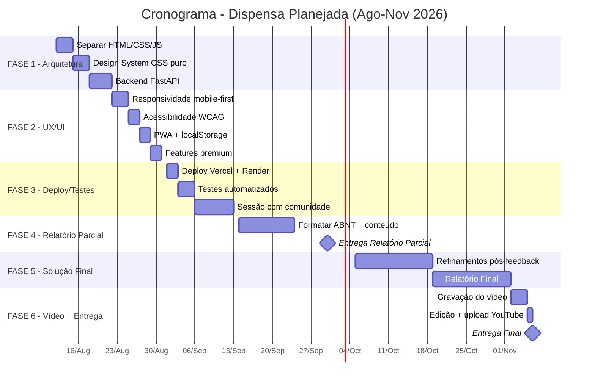

# 🛒 Plano de Profissionalização — Dispensa Planejada

**Projeto Integrador em Computação II — UNIVESP 2026.2**
**Data:** 12/08/2026 | **Polo:** Santos, SP

---

## 1. Diagnóstico do Estado Atual

### ✅ O que já está feito e funcional

| Componente | Status | Detalhe |
|---|---|---|
| **Web scraping** (3 lojas) | ✅ Completo | Carrefour, Atacadão, Pão de Açúcar via APIs REST (VTEX + GPA). 153.288 produtos. |
| **Catálogo unificado** | ✅ Completo | Dedup por EAN-13, score de relevância, apresentação regex. |
| **Frontend HTML/CSS/JS** | ✅ Funcional | Busca autocomplete, lista de compras, cálculo de melhor loja, modo checklist. |
| **Servidor local** | ✅ Funcional | `servidor_local.py` (http.server) para testes locais. |
| **Documentação acadêmica** | 🟡 Rascunho | `rascunho_plano_de_acao.md` com Plano de Ação + Questionário + Relatório Parcial. |
| **Screenshots de teste** | ✅ Existem | 13 capturas na pasta `testes_app/`. |

### ⚠️ Problemas Identificados (Gaps Críticos)

| # | Problema | Impacto |
|---|---|---|
| 1 | **Arquivo único monolítico** (`index.html` com 700 linhas — HTML + CSS + JS tudo junto) | Impossível manter, avaliar como "engenharia de software" na rubrica |
| 2 | **Sem backend real** — Flask em `backend/app.py` está desconectado, faz `subprocess.run` de script avulso | A rubrica exige demonstração de arquitetura e disciplinas cursadas |
| 3 | **JSONs gigantes servidos estaticamente** (42MB de `produtos_ampliado.json`) | Inviável em mobile, crash em celulares com pouca RAM, UX terrível |
| 4 | **Sem responsividade real** — usa TailwindCSS via CDN, mas layout não foi testado sistematicamente em mobile | Rubrica de IHC exige interface acessível e inclusiva |
| 5 | **Sem acessibilidade (WCAG)** — sem `aria-labels`, sem navegação por teclado completa, sem contraste validado | Perde nota em IHC e inclusão |
| 6 | **Sem persistência de lista** — recarregou a página, perdeu tudo | UX fraco para produto real |
| 7 | **Sem deploy público** — roda só via `python servidor_local.py` | Comunidade externa não pode testar remotamente. Rubrica de "implementação na comunidade" exige acesso real |
| 8 | **Sem testes automatizados** — zero testes unitários ou E2E | Não demonstra Engenharia de Software |
| 9 | **Relatório ABNT incompleto** — sem capa, sumário, resumo formatado, listas de figuras/tabelas | Rubrica de Linguagem e Referências (2.0 pts no parcial, 1.0 no final) |
| 10 | **Sem vídeo demonstrativo** — exigido pelo PI (5-10 min, YouTube) | 10% da nota final |

---

## 2. Exigências da UNIVESP vs. Estado Atual

### Mapa de Avaliações e Pesos

```
┌──────────────────────────────────────────────────────────────────┐
│ Avaliação 1: Plano de Ação ............... 15%  → 🟡 RASCUNHO  │
│ Avaliação 2: Relatório Parcial ........... 25%  → 🟡 RASCUNHO  │
│ Avaliação 3: Relatório Final ............. 35%  → 🔴 NÃO FEITO │
│ Avaliação 4: Vídeo + Ficha Prototipagem .. 10%  → 🔴 NÃO FEITO │
│ Avaliação 5: Avaliação Colaborativa ...... 15%  → 🔴 NÃO FEITO │
│                                           ────                  │
│                                           100%                  │
└──────────────────────────────────────────────────────────────────┘
```

### Requisitos Técnicos das Rubricas (Pontuação Máxima)

| Rubrica | Requisito | Nota Max | O que falta |
|---|---|---|---|
| **Solução Final e Aplicação** (Rel. Final) | Descrição detalhada com imagens do processo de construção + melhorias a partir do feedback da comunidade | 3.0 | Refatorar app, documentar processo, coletar feedback real |
| **Adequação ao Design Thinking** (Rel. Final) | Demonstrar Ouvir → Criar → Prototipar/Implementar | 2.0 | Registrar ciclo completo com evidências |
| **Relação com Disciplinas** (Rel. Final) | Mais de 3 disciplinas com referência explícita a materiais | 2.0 | Mapear disciplinas na arquitetura do app |
| **Apresentação da Solução** (Vídeo) | Solução em pleno funcionamento visível no vídeo | 3.0 | App precisa funcionar online de verdade |
| **Implementação na Comunidade** (Vídeo) | Relato de uso real pela comunidade + impactos | 2.0 | Precisa de deploy + sessão com comunidade |

---

## 3. Roadmap de Profissionalização

### FASE 1 — REFATORAÇÃO ARQUITETURAL (Semana 1: 12-18/ago)

> [!IMPORTANT]
> Esta fase é a fundação. Sem ela, o app não demonstra "Engenharia de Software" e perde nota.

#### 1.1 Separação de responsabilidades (SoC)

Reestruturar o monolito `index.html` em arquitetura profissional:

```
webapp/
├── index.html              ← HTML semântico limpo
├── css/
│   ├── design-system.css   ← Variáveis, tipografia, cores (Design Tokens)
│   ├── components.css      ← Cards, badges, tabelas, botões
│   └── layout.css          ← Grid, responsividade, media queries
├── js/
│   ├── app.js              ← Orquestrador principal
│   ├── dataLoader.js       ← Carregamento e indexação dos JSONs
│   ├── searchEngine.js     ← Motor de busca + autocomplete
│   ├── shoppingList.js     ← CRUD da lista com persistência localStorage
│   ├── priceCalculator.js  ← Algoritmo de melhor loja / multi-loja
│   ├── checklist.js        ← Modo checklist presencial
│   └── ui.js               ← Renderização / DOM manipulation
├── assets/
│   ├── icons/              ← Ícones SVG das lojas
│   └── img/                ← Logo, og-image
└── data/                   ← JSONs otimizados (ver 1.3)
```

**Disciplinas demonstradas:** Engenharia de Software (SoC, módulos), Programação Web (ES Modules), Estruturas de Dados (índices).

#### 1.2 Design System profissional (CSS puro — sem Tailwind CDN)

Substituir o Tailwind CDN por um design system autoral:

- **Paleta de cores** com variáveis CSS (`--color-primary`, `--color-surface`, etc.)
- **Tipografia** com Google Fonts (Inter ou Outfit)
- **Sistema de espaçamento** (8px grid)
- **Componentes** estilizados: cards com glassmorphism, badges, inputs com `:focus-visible`
- **Dark mode** (toggle com `prefers-color-scheme`)
- **Micro-animações** (hover, ripple, skeleton loaders)

**Disciplinas demonstradas:** IHC (design responsivo, acessibilidade), Programação Web (CSS moderno).

#### 1.3 Otimização de dados (resolver problema dos 42MB)

Os JSONs são gigantes demais para servir estáticos. Duas estratégias:

| Estratégia | Descrição | Prós | Contras |
|---|---|---|---|
| **A) API Backend** (recomendada) | Flask/FastAPI servindo busca paginada via endpoint `/api/buscar?q=leite&cat=Padaria` | Profissional, escalável | Requer hosting com Python |
| **B) JSON compactado + busca client-side** | Reduzir JSON (só campos essenciais), comprimir com gzip, indexar no browser via Web Worker | Funciona sem backend | Ainda pesado para celulares antigos |

> [!TIP]
> **Recomendação:** Usar a **Estratégia A** com um backend FastAPI simples no Render.com (free tier) ou PythonAnywhere. Isso demonstra mais disciplinas e é mais profissional.

#### 1.4 Backend API (FastAPI)

```python
# Estrutura proposta
backend/
├── main.py              ← App FastAPI
├── models.py            ← Pydantic models
├── services/
│   ├── product_service.py    ← Busca, filtros, paginação
│   └── price_service.py      ← Cálculo de melhor loja
├── data/
│   └── loader.py        ← Carrega e indexa JSONs em memória
├── requirements.txt
└── Procfile             ← Deploy no Render
```

**Endpoints essenciais:**
- `GET /api/produtos?q=leite&categoria=Padaria&marca=Piracanjuba&page=1&limit=20`
- `GET /api/categorias` — lista categorias disponíveis
- `GET /api/marcas?categoria=Padaria` — marcas filtradas
- `POST /api/calcular` — recebe lista de EANs+qtds, retorna análise completa

---

### FASE 2 — UX/UI PROFISSIONAL (Semana 2: 19-25/ago)

#### 2.1 Responsividade mobile-first

- Layout mobile-first com breakpoints em 640px, 768px, 1024px
- Touch targets mínimos de 44×44px (WCAG)
- Navegação bottom-bar em mobile com ícones
- Swipe-to-delete na lista de compras

#### 2.2 Acessibilidade (WCAG 2.1 AA)

| Item | Implementação |
|---|---|
| `aria-label` em todos os botões interativos | Cada botão tem descrição textual |
| `role="status"` nos contadores | Screen readers anunciam mudanças |
| Contraste mínimo 4.5:1 | Validar todas as combinações de cor |
| Navegação completa por teclado | Tab order lógico, `Escape` fecha modais |
| Skip links | "Pular para conteúdo principal" |
| `lang="pt-BR"` no `<html>` | ✅ Já existe |

#### 2.3 Persistência da lista (localStorage)

- Salvar lista automaticamente em `localStorage`
- Restaurar ao reabrir o app
- Botão "Exportar lista" → gera texto/WhatsApp para compartilhar

#### 2.4 Progressive Web App (PWA)

- `manifest.json` com nome, cores, ícones
- Service Worker para cache offline das páginas e assets
- Permite "Adicionar à tela inicial" no celular
- Funciona offline (ao menos a lista salva)

**Disciplinas demonstradas:** IHC (acessibilidade, usabilidade), Programação Web (PWA, Service Workers).

#### 2.5 Funcionalidades premium

| Feature | Descrição | Valor para comunidade |
|---|---|---|
| **Estimativa de economia mensal** | Baseada no histórico de listas do usuário | Engajamento |
| **Compartilhar via WhatsApp** | Botão que gera texto formatado da lista+preços | Viralização na comunidade |
| **Indicador de cesta básica** | Badge visual nos produtos essenciais (DIEESE) | Educação financeira |
| **Comparativo "Antes vs. Depois"** | Mostra quanto a pessoa economizaria se planejasse | Narrativa para o relatório |

---

### FASE 3 — DEPLOY E TESTES (Semana 3: 26/ago - 01/set)

#### 3.1 Deploy público

| Opção | Frontend | Backend | Custo | Recomendação |
|---|---|---|---|---|
| **Vercel + Render** | Vercel (estático) | Render (FastAPI, free tier) | R$ 0 | ⭐ Recomendada |
| **GitHub Pages + PythonAnywhere** | GitHub Pages | PythonAnywhere (free) | R$ 0 | Alternativa |
| **Render full-stack** | Servido pelo FastAPI | Render | R$ 0 | Mais simples |

> [!IMPORTANT]
> O deploy público é **obrigatório** para a rubrica "Implementação na comunidade externa" (2.0 pts no vídeo, 3.0 pts no relatório final). A comunidade precisa poder acessar o app pelo celular.

#### 3.2 Testes automatizados

```
testes/
├── test_search.py         ← Testa o motor de busca (word boundary, relevância)
├── test_price_calc.py     ← Testa cálculos de melhor loja e multi-loja
├── test_api.py            ← Testa endpoints da API (FastAPI TestClient)
└── test_e2e.py            ← Playwright: fluxo completo no browser
```

**Disciplinas demonstradas:** Engenharia de Software (testes, QA).

#### 3.3 Sessão com comunidade externa

- Realizar sessão presencial ou virtual com 5-10 moradores de Santos
- Coletar feedback via formulário pós-uso
- Documentar com fotos/prints e depoimentos (com TCLE)
- Iterar no app com base no feedback (Design Thinking: ciclo Ouvir → Criar → Implementar)

---

### FASE 4 — DOCUMENTAÇÃO ACADÊMICA (Semana 4-5: 02-20/set)

#### 4.1 Relatório Parcial (Entrega Q4: ~30/set)

Estrutura conforme modelo UNIVESP:

```
1. Capa (com link do vídeo)
2. Sumário
3. Resumo + Palavras-chave
4. Introdução
   4.1 Contextualização
   4.2 Relação com disciplinas (5+ disciplinas)
5. Objetivos (geral + específicos)
6. Justificativa e Problema de Pesquisa
7. Fundamentação Teórica (fontes acadêmicas confiáveis)
8. Metodologia (Design Thinking: Ouvir, Criar, Prototipar)
9. Solução Inicial (protótipo funcional com screenshots)
10. Referências (ABNT)
```

> [!WARNING]
> O rascunho em `rascunho_plano_de_acao.md` está **bom em conteúdo**, mas precisa ser formatado em ABNT (capa, sumário, normas de citação). Texto sem ABNT = metade da nota em "Linguagem e Referências".

#### 4.2 Mapeamento de Disciplinas (Rubrica: 2.0 pts)

| Disciplina | Onde aparece no projeto | Material de referência |
|---|---|---|
| **Programação Web** | Frontend HTML/CSS/JS, ES Modules, API REST | Conteúdo semana X |
| **Banco de Dados** | Modelagem JSON por EAN-13, índices de busca, normalização | Conteúdo semana Y |
| **Engenharia de Software** | Arquitetura em camadas, SoC, testes, Git, CI/CD | PRESSMAN, 2016 |
| **IHC** | Design responsivo, acessibilidade WCAG, Design Thinking | Conteúdo semana Z |
| **Estruturas de Dados** | Algoritmo de relevância, busca com índices, Map/Set | Conteúdo semana W |
| **Ciência de Dados** | Web scraping, ETL, análise estatística de preços | Conteúdo semana V |

---

### FASE 5 — SOLUÇÃO FINAL E RELATÓRIO FINAL (Semana 5-9: 21/set - 01/nov)

#### 5.1 Refinamentos pós-feedback

- Incorporar sugestões da comunidade
- Documentar ciclo "antes → feedback → depois" com screenshots comparativos
- Gráficos de economia real (dados reais de uso)

#### 5.2 Relatório Final (Entrega Q7: ~06/nov)

Adicionar ao parcial:

```
9. Resultados
   9.1 Evolução da solução (inicial → final)
   9.2 Feedback da comunidade e melhorias implementadas
   9.3 Dados quantitativos (acessos, listas criadas, economia média)
10. Considerações Finais
    10.1 Retomada dos objetivos
    10.2 Contribuições e limitações
    10.3 Impacto na comunidade
    10.4 Trabalhos futuros
11. Referências (ABNT completas)
12. Apêndices
    12.1 TCLE assinados
    12.2 Questionário + respostas tabuladas
    12.3 Screenshots do sistema
```

---

### FASE 6 — VÍDEO YOUTUBE (Semana 9-10: 02-06/nov)

#### Roteiro do vídeo (5-10 minutos)

| Tempo | Conteúdo | Rubrica atendida |
|---|---|---|
| 0:00 - 0:30 | Abertura: nome do grupo, polo, título do projeto | Identificação (1.0) |
| 0:30 - 1:30 | Problema: perda de poder de compra, compras por impulso | Apresentação do problema (1.0) |
| 1:30 - 4:00 | Demo ao vivo: busca, lista, cálculo, checklist | Apresentação da solução (3.0) |
| 4:00 - 6:00 | Feedback da comunidade, melhorias, impacto | Implementação na comunidade (2.0) |
| 6:00 - 7:30 | Slides com arquitetura, disciplinas, Design Thinking | Utilização de recursos (2.0) |
| 7:30 - 8:00 | Considerações finais | Encerramento |
| **Total** | **~8 minutos** | **Dentro do limite (1.0)** |

---

## 4. Cronograma Alinhado às Quinzenas UNIVESP



---

## 5. Decisões Técnicas para Discussão

> [!IMPORTANT]
> As decisões abaixo afetam o escopo do trabalho. Precisamos alinhar antes de começar a implementação.

### Decisão 1: Backend — FastAPI ou manter estático?

| Opção | Prós | Contras |
|---|---|---|
| **FastAPI (recomendada)** | Demonstra mais disciplinas, escala melhor, resolve o problema dos 42MB | Mais complexo, exige hosting Python |
| **Estático otimizado** | Mais simples, funciona no GitHub Pages | Não resolve o problema de performance real, demonstra menos habilidades |

### Decisão 2: Framework CSS

| Opção | Prós | Contras |
|---|---|---|
| **CSS puro (recomendado)** | Demonstra domínio real, sem dependências externas, design system autoral | Mais trabalho |
| **Tailwind CSS (instalado via npm)** | Rápido, consistente | Já está usando via CDN, mas de forma frágil |

### Decisão 3: Deploy

| Opção | Prós | Contras |
|---|---|---|
| **Vercel (front) + Render (back)** | Grátis, profissional, domínio customizável | Duas plataformas |
| **Render full-stack** | Uma plataforma só | Menos otimizado para estáticos |
| **GitHub Pages + PythonAnywhere** | Familiar | PythonAnywhere tem limitações de banda |

### Decisão 4: Escopo de funcionalidades

Quais features premium implementar? (Selecione prioridades)

- [ ] PWA (instalar no celular)
- [ ] Dark mode
- [ ] Compartilhar via WhatsApp
- [ ] Estimativa de economia mensal
- [ ] Badge de cesta básica DIEESE
- [ ] Histórico de listas
- [ ] Gráfico comparativo de preços

---

## 6. Checklist de Entregáveis

### Para nota máxima em cada avaliação:

- [ ] **Plano de Ação** (15%) — Formatar em modelo ABNT com todas as quinzenas detalhadas
- [ ] **Relatório Parcial** (25%) — Capa, sumário, resumo, 5+ disciplinas, fundamentação teórica acadêmica, metodologia DT, solução inicial com screenshots, ABNT
- [ ] **Relatório Final** (35%) — Tudo do parcial + resultados, considerações finais, feedback da comunidade, evolução da solução, TCLE
- [ ] **Vídeo** (10%) — 5-10 min, YouTube, demo ao vivo, identificação do grupo, problema, solução em funcionamento, comunidade
- [ ] **Avaliação Colaborativa** (15%) — Reunião com orientador na Q6, definir 3 indicadores, avaliar cada integrante

### Para produto profissional:

- [ ] Refatorar monolito em módulos (HTML/CSS/JS separados)
- [ ] Design System autoral com dark mode e micro-animações
- [ ] Backend API para busca paginada
- [ ] Deploy público acessível pelo celular
- [ ] PWA instalável
- [ ] Testes automatizados (unitários + E2E)
- [ ] Acessibilidade WCAG 2.1 AA
- [ ] Sessão de teste com comunidade real

---

## 7. Próximos Passos Imediatos

1. **Revisar este plano juntos** e tomar as decisões pendentes (Seção 5)
2. **Começar pela Fase 1.1** — separar o `index.html` em módulos
3. **Criar Design System** CSS puro com paleta de cores e tipografia
4. **Implementar Backend FastAPI** com busca paginada
5. **Deploy mínimo** para validar que funciona online

> [!TIP]
> Podemos começar a executar a Fase 1 agora mesmo. Qual decisão técnica você quer resolver primeiro?
